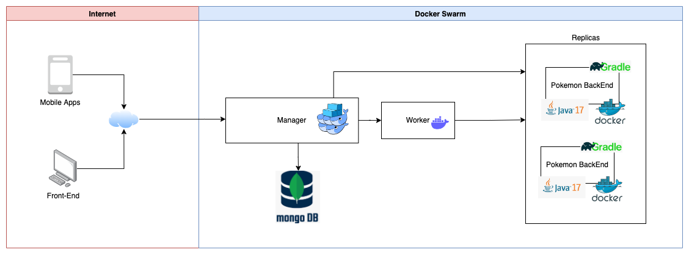

# Projeto de conclusão da disciplina de Containers e Virtualization da FIAP (MBA)

Esse projeto tem o objetivo de demonstrar a utilização do docker swarm para implantação e execução de aplicações.

# Dependências

- Java 17
- Gradle
- Docker

# Como executar (Unix/MacOS)

Abra um terminal na raiz do projeto e digite os comandos:

- buildar a aplicação
> gradle clean build
- executar o ambiente com docker-compose
> docker-compose -f docker-compose.yml up -d
- encerrar o ambiente
> docker-compose down

# Postman

Na pasta "postman" na raiz do projeto, estão as collections e o environment do Postman para importação

# Demonstração

https://www.loom.com/share/327c6f7b390f44ecb69089cbf34f9976

# URL dos Serviços

### API e-commerce

Serviço responsável pelo gerenciamento dos times pokemons
- localhost:5000

# Arquitetura

Foi utilizada arquitetura de micro-serviços, criando um back-end para servir diversos tipos de front-end.

